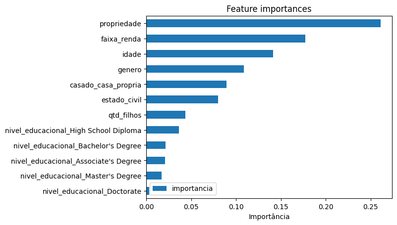
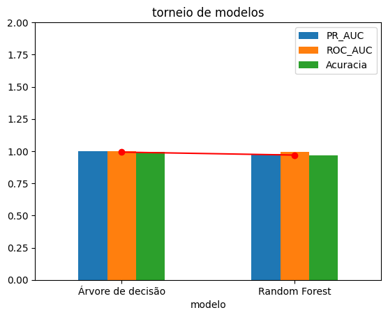
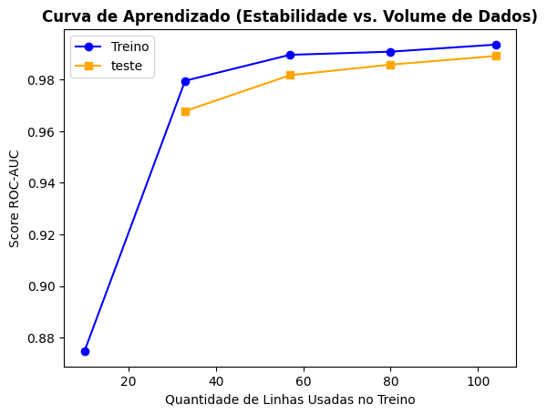
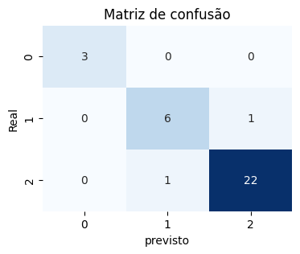

# 🤖 modelo preditivo de classificação de score de crédito

Reduzir o risco de inadimplência, substituir análises manuais lentas por aprovações automatizadas, instantâneas e escaláveis,
permitir oferecer juros menores e/ou juros adequados para bons pagadores ou de acordo com o perfil do cliente e identificar padrões sutis de comportamento que os modelos tradicionais dos bancos não conseguem enxergar, são alguns dos objetivos de vários segmentos de negócios, como e-commerce, fintechs, empresas de telecon, entre outros.

Dessa forma, esse projeto tras um modelo de machine learning como ***solução de negócio***, capaz de realizar um controlo rigoroso do risco de crédito e classificar os novos clientes com uma classe de score de crédito: baixa, média ou alta, atravéz de dados demográficos e socioeconômicos do indivíduo, mitigando riscos, automatizando decisões, auxiliando o time com personalização de campanhas e passando a ser um motor de crescimento sustentável e vantagem competitiva.

---
## 🛠️ Arquitetura Modular do Projeto
O projeto foi estruturado seguindo as melhores práticas em 3 etapas independentes e encadeadas:

1.  **`01_coleta_tratamento_eda.ipynb`**: Pré-processamento, limpeza e separação da base em treino e teste para avaliação honesta da performance do modelo, além de tratamento de nulos e exploração dos dados.
2.  **`02_engenharia_atributos.ipynb`**: Etapa de pre-modelagem com criação de munições de negócio baseadas em insights encontrados na etapa de EDA. Tratamento de categóricas via *Dummies* e alinhamento simétrico das partições de treino e teste via técnica de `.reindex`.
3.  **`03_modelagem.ipynb`**: Treinamento, validação cruzada estruturada (`StratifiedKFold`), torneio de modelos entre Árvore de decisão e Random forest, otimização de hiperparâmetros (`RandomizedSearchCV`), análise de curvas de aprendizado, matriz de confusão, feature importances

---
## 🧠 3. Engenharia de Atributos 
Para simular perfeitamente o ambiente de produção, munimos o modelo com:
variável `faixa_renda` segmentando os clientes por renda e `casado_casa_propria` que mostrou forte correlação com a variável alvo



*   **Propriedade:** dado demográfico que mostra se o cliente possui patrimônio.
*   **faixa de renda:** dado socioecononico que tras a capacidade financeira do cliente.
*   **idade:** forte atributo, pois clientes mais maduros, costumam ter uma vida financeira mais sólida.
*   **gênero:** dado demográfico importante para o modelo.
*   **casado_casa_propria:** flag que trás mais informação para o modelo tomar decisões.

---
## 📊 4. Torneio de Modelos e Resultados Práticos

Os modelos foram avaliados utilizando a métrica **ROC-AUC** para estabilidade global e a **PR-AUC (Precision-Recall)** devido ao desbalanceamento natural da base (poucos clientes possuem baixo score). 


|    | modelo            |   PR_AUC |   ROC_AUC |   Acuracia |
|---:|:------------------|---------:|----------:|-----------:|
|  0 | Árvore de decisão |    0.997 |     0.999 |      0.992 |
|  1 | Random Forest     |    0.98  |     0.993 |      0.969 |




---
Após o tuning e análise da performance do modelo campeão nos dados de treinamento final antes do teste final, o **Random Forest Otimizado** atingiu uma PR-AUC estável de **0.97** na base de treinamento final, mostrando excelente capacidade de detectar corretamente o score de crédito do cliente.




o modelo não apresentou que precise de mais dados para melhorar, pois a linha de validação não continua subindo no final do gráfico e o modelo não está sofrendo overfitting, pois as linhas estão extremamente próximas, portanto o modelo apresentou estabilidade.

O modelo foca também na classe minoritária, com a técnica `class_weight='balanced'`, não sendo necessários ajustes no threshold de calibração. Unindo isso a distribuição equilibrada da importância das colunas, o modelo **Random Forest** atingiu uma PR-AUC estável de **0.96** no teste final.

| Métrica | Desempenho na Base de Teste |
| :--- | :---: |
| **ROC_AUC** | **98%** |
| **Acurácia** | **94%** |
| **PR-AUC Final** | **0.96** |


### 🧩 Análise de Impacto Operacional (Matriz de Confusão)

Matriz de Confusão (Teste):



o modelo apresenta bastante precisão, acertando 31 scores de crédito e errando apenas 2 amostras.

---
## 💾 Estrutura do Repositório e Execução
```text
📁 RISCO DE CRÉDITO/
├── 📁 bases/                     
├── 📁 notebooks/                 
│   ├── 01_coleta_tratamento_eda.ipynb
│   ├── 02_engenharia_atributos.ipynb
│   └── 03_modelagem.ipynb
├── 📜 .gitignore                          
└── 📜 README.md                  
```

Para reproduzir este projeto, instale as dependências e execute os notebooks respeitando a ordem cronológica.

